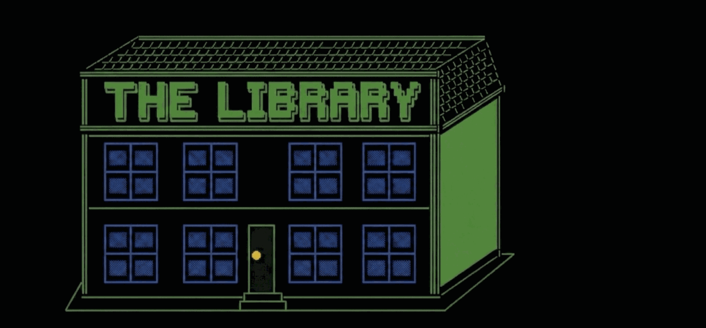

<p align="center">
  
</p>

<p align="center">
  <strong>Open-source meta-system for AI-assisted project management.</strong><br/>
  Session continuity, knowledge management, and PM tracking through a Claude Code skill suite backed by an MCP server.
</p>

<p align="center">
  <a href="https://github.com/sevenbelowllc/the-library"></a>
  <a href="https://pypi.org/project/the-library/"></a>
  <a href="https://pypi.org/project/the-library/"></a>
</p>

## What It Does

| Component | What It Is |
|-----------|-----------|
| **The Library** | The system — 11 skills + MCP server + config |
| **The Reading Room** | Your project's working area — specs, plans, checkpoints, project assets (repo or directory) |
| **The Vault** | Knowledge base — Obsidian-native (wikilinks, tags), Karpathy 3-layer pattern |
| **Graphify** | Card catalog — cross-document relationship queries (optional) |
| **PM Adapter** | Circulation desk — configurable Jira or Linear integration |

## Install

```bash
pip install the-library
```

Optional dependencies:
```bash
pip install the-library[linear]    # Linear PM adapter
pip install the-library[graphify]  # Graphify knowledge graph
pip install the-library[all]       # Everything
```

## Quick Start

```bash
# 1. Install
pip install the-library

# 2. Initialize (creates config, vault, hooks, domains — one command)
cd your-project
library init

# 3. (Optional) Install the Claude Code plugin for skills
claude plugins install sevenbelowllc/the-library

# 4. (Optional) Interactive fine-tuning in Claude Code
library:config
```

`library init` handles everything: config file, Reading Room, vault structure, runtime directories, SESSION.md, PROJECT-STATE.md, domain manifests, hooks, and validation. One command, zero manual steps.

### Reading Room Setup

The Reading Room is where your project's "books" live — canonical specs, implementation plans, session checkpoints, and project assets. It can be:

- **A dedicated repo** — for multi-repo projects where specs span multiple codebases
- **A directory at the repo root** — for monorepos (e.g., `reading-room/` or `.library/`)

## Skills

| Skill | Purpose |
|-------|---------|
| `library:config` | Setup and configuration |
| `library:ingest` | Add source material to the vault |
| `library:compile` | Compile wiki articles from sources |
| `library:query` | Ask the Librarian questions |
| `library:memory` | Memory lifecycle management |
| `library:sync` | PM state sync |
| `library:triage` | Turn vault tags into PM tasks |
| `library:plan` | Convert specs into PM epics/tasks |
| `library:audit` | Spec vs code gap analysis |
| `library:review` | Completion validation |
| `library:checkpoint` | Session state capture |

## MCP Server

The Library runs as an MCP server exposing 31 tools across 7 modules:

| Module | Tools |
|--------|-------|
| Config | `library:config:get`, `library:config:set` |
| Vault | `library:vault:init`, `library:vault:validate`, `library:vault:parse`, `library:vault:ingest` |
| PM | `library:pm:create_task`, `library:pm:create_epic`, `library:pm:sync`, `library:pm:update`, `library:pm:query`, `library:pm:create_project`, `library:pm:list_projects`, `library:pm:get_project`, `library:pm:update_project`, `library:pm:assign_task`, `library:pm:link_issues`, `library:pm:get_link_types` |
| Memory | `library:memory:scan`, `library:memory:aggregate`, `library:memory:prune`, `library:memory:health`, `library:memory:learn` |
| Checkpoint | `library:checkpoint:write`, `library:checkpoint:read`, `library:checkpoint:list` |
| Graph | `library:graph:rebuild`, `library:graph:query`, `library:graph:path` |
| Vault Builder | `library:vault_builder:config`, `library:vault_builder:survey`, `library:vault_builder:preview`, `library:vault_builder:build`, `library:vault_builder:extract` |
| Dev | `library:dev:token_report` |

```bash
# Initialize (creates config, vault, hooks — everything)
library init

# Run MCP server standalone
library

# Validate installation
library validate

# Auto-fix common issues
library doctor
```

## Documentation

| Guide | Purpose |
|-------|---------|
| [Quickstart](docs/setup/quickstart.md) | Install, init, first run |
| [Reading Room Setup](docs/setup/reading-room-setup.md) | Configure your project's Reading Room |
| [Jira Setup](docs/setup/jira-setup.md) | API token, env vars, project setup |
| [Linear Setup](docs/setup/linear-setup.md) | Linear integration |
| [Vault Builder Guide](docs/guides/vault-builder.md) | ETL pipeline: sources, extraction, Graphify |
| [PM Integration](docs/guides/pm-integration.md) | Project & ticket management |
| [Skills Reference](docs/guides/skills-reference.md) | All skills with usage guidance |
| [MCP Tools Catalog](docs/reference/mcp-tools.md) | Complete tool reference |
| [Vault Builder API](docs/reference/vault-builder-api.md) | Extractor development guide |
| [Jira API Reference](docs/reference/jira-api.md) | REST endpoints, field mappings |

## Configuration

See `library-config.example.yaml` for all options.

## Memory Management Unit (v0.2.0)

The Library includes a Memory Management Unit (MMU) that prevents contextual drift across AI-assisted development sessions.

### How It Works

- **800 token baseline** — Injects minimal project context at session start (PROJECT-STATE.md + SESSION.md)
- **Demand-paged** — Domain-specific context loaded only when keyword patterns match your prompts
- **Zero-token hooks** — 6 lifecycle hooks run programmatically, never consuming LLM tokens
- **Auto-learning** — Observes which context injections help and which are noise, proposes improvements over time
- **Crash recovery** — Stop hook heartbeat updates SESSION.md every turn, max 1 turn lost on crash

### Architecture

```
Context Window (RAM)          Hooks (Interrupt Handlers)       Vault (Disk)
├─ CRITICAL ~300 tokens       ├─ SessionStart (boot)           ├─ domains/
├─ FRESH ~500 tokens          ├─ UserPromptSubmit (page fault)  ├─ decisions/
├─ MODERATE 0-1500 tokens     ├─ Stop (heartbeat)              ├─ sessions/
└─ DEEP 0-unlimited           ├─ PreCompact (emergency save)   ├─ sources/raw/
                               ├─ SessionEnd (shutdown)         └─ wiki/
                               └─ StatusLine (monitor)
```

### Setup

The MMU is configured automatically during `library init` or `library:config` setup. Two questions:
1. Where is your Reading Room?
2. Do you use Jira, Linear, or neither?

Everything else uses smart defaults. Run `/library-config` to customize.

### Spec

Full specification: [MEMORY-MANAGEMENT.md](../library-reading-room/specs/MEMORY-MANAGEMENT.md)

## License

MIT - SevenBelow LLC

---

<p align="center">
  <a href="https://sevenbelow.com">
    
  </a>
</p>
